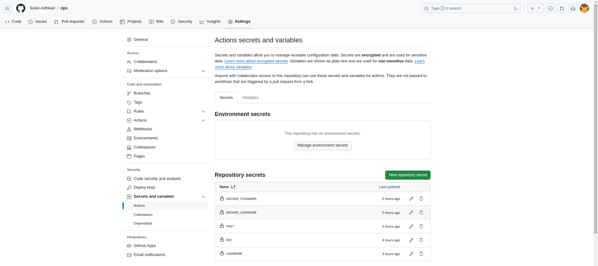

# Write Terraform code to provision an EC2 instance and configure it to run Docker using cloudinit.


**prerequisites**

- terraform

To install terraform we can follow the official documentation provided by hasicorp

[Installation](https://developer.hashicorp.com/terraform/tutorials/aws-get-started/install-cli)

- aws cli

To install the aws cli we can follow the official documentation provided by AWS 

[Installation](https://docs.aws.amazon.com/cli/latest/userguide/getting-started-install.html)

- aws configure 

It is not a good practice to pass the aws credentials i.e hardcode access id and secret key in the code it self so we need to pass the aws credentials using aws configure command.

```bash
aws configure
```

Now that all the prerequisites are satisfied we can move on to building a EC2 instance using terraform 

**Requirements**

- Provider

As we are deploying our infrastructure in the aws cloud we need to use aws as provider.

```yml
provider "aws" {
  region = "us-east-1"
}
```

- VPC

For the vpc i will be using the default vcp provided by the aws , we do not need to create a separate vpc for this project we just require a vpc with internet gateway attached to it .

- Security Group

We need to create a security group that will allow traffic on port 80 and 3000 for application to run and port 22 to allow ssh connection.

```yml
resource "aws_security_group" "webapp_SG" {
  name        = "security group webapp"
  description = "security group webapp"
  vpc_id      = "vpc-0b23c7ab9d0828203"


  ingress {
    description      = "HTTP"
    from_port        = 80
    to_port          = 80
    protocol         = "tcp"
    cidr_blocks      = ["0.0.0.0/0"]
    ipv6_cidr_blocks = ["::/0"]
  }

  ingress {
    description      = "SSH"
    from_port        = 22
    to_port          = 22
    protocol         = "tcp"
    cidr_blocks      = ["0.0.0.0/0"]
    ipv6_cidr_blocks = ["::/0"]
  }

  ingress {
    description      = "webapp"
    from_port        = 3000
    to_port          = 3000
    protocol         = "tcp"
    cidr_blocks      = ["0.0.0.0/0"]
    ipv6_cidr_blocks = ["::/0"]
  }

  egress {
    from_port        = 0
    to_port          = 0
    protocol         = "-1"
    cidr_blocks      = ["0.0.0.0/0"]
    ipv6_cidr_blocks = ["::/0"]
  }

  tags = {
    Name = "webapp_SG"
  }
}
```

- SSH key

We need to create a ssh key pair that will be used to connect to the EC2 instance.As later when we will implement CI/CD we need to establish a ssh connection to the ec2 instance to execute commands.

```yml
resource "aws_key_pair" "webpoint_key" {
  key_name   = "webpoint_key"
  public_key = tls_private_key.rsa.public_key_openssh
}


# RSA key of size 4096 bits
resource "tls_private_key" "rsa" {
  algorithm = "RSA"
  rsa_bits  = 4096
}

resource "local_file" "webpoint_key" {
  content  = tls_private_key.rsa.private_key_pem
  filename = "webpointkey"
}
```

The above hcl code will create a ssh key pair and store the private key named `webpointkey` in the local file system and public key named `webpoint_key` in the aws cloud.

- Cloudinit script (User data)

To implement the cloudinit i have created a script file named `script.sh` which includes all the commands that need to be executed on the ec2 instance to install docker.

Then i referenced the `script.sh` file as user data for the aws ec2 instance. And When your Terraform script provisions the EC2 instance, Cloud-init activates during the initial boot process.


- EC2 Instance

Now that security group, the key pair and user data are configured we can now create a ec2 instance and attach the security group , the user data and  the key pair to it.

```yml
resource "aws_instance" "web" {
  ami           = "ami-080e1f13689e07408"
  instance_type = "t2.micro"
  user_data = file("script.sh")
  security_groups = [aws_security_group.webapp_SG.name]
  key_name = "webpoint_key"

  tags = {
    Name = "webpoint-ec2"
  }
}
```

Deployment Successful :


In AWS console:

Public key:


Security group:


EC2 instance:


**Code for the terraform is in `Terraform` Directory**


# 2. Create NextJs app using `npx create-next-app@latest` and Dockerized application and push it github


To create a simple NextJs app using npx execute the command:

```bash
npx create-next-app@latest my-nextjs-app
```

Now that a app is created lets Dockerize the application:

First to dockerize the application i wrote a docker file with a single stage while doing so the resulting size of the image was approximately 2.2 gb which is too big for a docker image and not optimal for deployment. 


So to resolve this issue i modified the docker file to have two stages:

In the first stage i have build the application and then copied the build files to the second stage.Which significantly reduced the size of the image from 2.2 gb to 767MB.


**Stage 1: Build the Next.js app**

- FROM node:20-alpine AS build : Uses Node.js 20 on Alpine Linux as the base image

- WORKDIR /usr/src/app : Sets working directory to /usr/src/app

- COPY package*.json ./ : Copies package.json and package-lock.json to working directory

- Copy . . : Copies all files and folders from host to working directory

- RUN npm install : Installs all dependencies present in package.json

**Stage 2: Run the Next.js app**

- FROM node:20-alpine : Uses Node.js 20 on Alpine Linux as the base image

- WORKDIR /usr/src/app : Sets working directory to /usr/src/app

- COPY --from=build /usr/src/app/package*.json ./: Copies package.json and package-lock.json from the build stage into the container's working directory. This step ensures that only the necessary dependencies are copied, not the entire source code.

- RUN npm install : Installs all dependencies present in package.json

- COPY --from=build /usr/src/app/.next ./.next: Copies the .next directory which contains the built Next.js app from the build stage into the  working directory.

- EXPOSE 3000 : Exposes port 3000 to the host

- CMD ["npm", "run", "start"] : Runs the Next.js app


```yml
# Stage 1: Build the Next.js app
FROM node:20-alpine AS build

WORKDIR /usr/src/app

COPY package*.json ./

RUN npm install

COPY . .

RUN npm run build


FROM node:20-alpine

WORKDIR /usr/src/app

COPY --from=build /usr/src/app/package*.json ./

RUN npm install 

COPY --from=build /usr/src/app/.next ./.next

EXPOSE 3000

CMD ["npm", "start"]

```

# Create a CI/CD pipeline to deploy the containerized application to the EC2 instance using Docker stack or Docker Compose.


In the root create a directory .github/workflow and create a file named yml in it.Then the github will automatically detect the yml and trigger the pipeline according to the configuration.

**Setting up the repository variables and secrets:**

As to push the images in the docker hub we need to pass the credentials of the docker in the cicd pipeline also to interact with the EC2 instance we need to pass the private key , ec2 ip address and ec2 username in the cicd pipeline. And directly hardcoding the credentials in the workflow will definitely cause security risk  so to pass sensitive to pass the private key in the cicd pipeline we need to store it in the github secrets and then pass them as secrets in the workflow.




Workflow file : The pipeline has four significant steps  `Login to docker hub` step uses the secrets to login to the docker hub. `Build docker image` step uses the dockerfile to build the image tag the image and push it to the docker hub. `Scp docker-compose.yml` step uses the private key to scp the docker-compose.yml file to the EC2 instance. `SSh into EC2` step uses the private key to ssh to the EC2 instance and deploy the docker compose file which pulls the image form the docker hub repository and then run the container for the pulled image.

From this approach whenever a push is detected in the repository the pipeline will be triggered and the docker image will be built and pushed to the docker hub and then the docker compose file will be scp to the EC2 instance and then the docker compose file will be deployed with the latest image to the EC2 instance.

```yml 

name: Docker build and deploy

on:
    push:
        branches:
            - main

jobs:
    build:
        runs-on: ubuntu-latest

        steps:
            - name: Checkout
              uses: actions/checkout@v2

            - name: Login to docker hub
              uses: docker/login-action@v1
              with:
                  username: ${{ secrets.DOCKER_USERNAME }}
                  password: ${{ secrets.DOCKER_PASSWORD }}
            
            - name: Build docker image
              run: |
               docker build -t sulavadk7/wp-image:stable .
               docker push sulavadk7/wp-image:stable

            - name: Scp docker-compose.yml
              uses: appleboy/scp-action@v0.1.7
              with:
                host: ${{ secrets.HOST }}
                username: ${{ secrets.USERNAME }}
                key: ${{ secrets.KEY }}
                source: "docker-compose.yml"
                target: "/home/ubuntu/docker"
                


            - name: SSh into EC2
              uses: appleboy/ssh-action@v1.0.3
              with:
                host: ${{ secrets.HOST }}
                username: ${{ secrets.USERNAME }}
                key: ${{ secrets.KEY }}
                script: |

                 sudo docker compose -f /home/ubuntu/docker/docker-compose.yml pull
                 sudo docker compose -f /home/ubuntu/docker/docker-compose.yml up -d
```

Pipeline completed successfully :


Docker image is pushed to docker hub :


Docker compose file successfully copied to ec2 , image pulled successfully , Docker container is running :


Web app is accessible from browser at <ec2ip>:port and <ec2PublicDns>:3000


**npi.io**

Nip.io is a free and simple DNS service designed specifically for local development testing of web applications. It addresses the inconvenience of sharing a local machine's internal IP address with collaborators for testing purposes.


